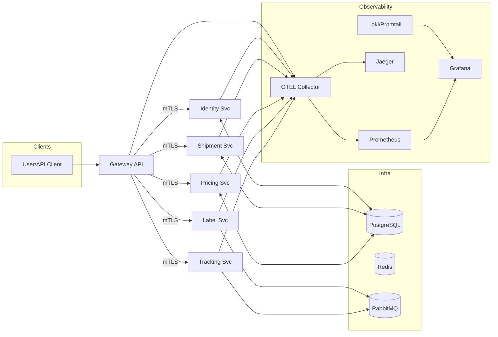

# Logistics Universal

[](https://github.com/joshuarotgers711-beep/logistics_universal/actions/workflows/gateway-api-ci.yml)
[](https://github.com/joshuarotgers711-beep/logistics_universal/actions/workflows/identity-svc-ci.yml)
[](https://github.com/joshuarotgers711-beep/logistics_universal/actions/workflows/shipment-svc-ci.yml)
[](https://github.com/joshuarotgers711-beep/logistics_universal/actions/workflows/pricing-svc-ci.yml)
[](https://github.com/joshuarotgers711-beep/logistics_universal/actions/workflows/label-svc-ci.yml)
[](https://github.com/joshuarotgers711-beep/logistics_universal/actions/workflows/tracking-svc-ci.yml)
[](https://github.com/joshuarotgers711-beep/logistics_universal/actions/workflows/observability.yml)
[](https://github.com/joshuarotgers711-beep/logistics_universal/actions/workflows/perf.yml)

A modular, open-source logistics management platform with an API gateway, domain microservices (identity, shipment, pricing, label, tracking), and a production-grade observability stack. The platform supports mutual TLS (mTLS) for service-to-service auth, secrets via the `*_FILE` pattern, and a fully local, free/open-source setup.

## Architecture



## Highlights

- API Gateway with service-to-service mTLS
- Microservices: identity, shipment, pricing, label, tracking
- PostgreSQL, Redis, RabbitMQ
- Observability: OpenTelemetry, Prometheus, Grafana, Jaeger, Loki/Promtail
- SLO dashboards, alerts, CI observability gates
- Deterministic alert exercise endpoints and business KPI dashboards

## Quick Start (Local)

Prereqs: Docker + Docker Compose; (optional) Node 20, Go 1.22, Python 3.11

Build images (first time):

- gateway-api: `docker build -t gateway-api:local services/gateway-api`
- identity-svc: `docker build -t identity-svc:local services/identity-svc`
- shipment-svc: `docker build -t shipment-svc:local services/shipment-svc`
- pricing-svc: `docker build -t pricing-svc:local services/pricing-svc`
- label-svc: `docker build -t label-svc:local services/label-svc`
- tracking-svc: `docker build -t tracking-svc:local services/tracking-svc`

Start infra + services:

```bash
docker compose up -d postgres redis rabbitmq otel-collector prometheus grafana loki promtail jaeger
# Start services (compose or local):
docker compose up -d gateway-api identity-svc shipment-svc pricing-svc label-svc tracking-svc
```

Smoke test (via gateway):

```bash
bash scripts/smoke.sh
```

## mTLS Validation (Artifacts + Report)

- Run validation script (captures curl/Prom/Jaeger outputs into `.artifacts/mtls/`):

```bash
bash scripts/mtls_validation.sh
```

- Report: `docs/mtls_validation_report.md`
- Screenshot: `.artifacts/mtls/grafana_mtls_traffic.png`
- Renderer headers: `.artifacts/mtls/grafana_render_headers.txt`

## Observability

Dashboards and workflows are pre-provisioned.

- Grafana: <http://localhost:3000>
- Prometheus: <http://localhost:9090>
- Jaeger: <http://localhost:16686>
- Loki: <http://localhost:3100>

See the runbook for queries, alerts, and smoke validation:

- `docs/runbooks/observability.md`

## Documentation Map

- Local dev: `docs/LOCAL_DEV.md`
- mTLS validation: `docs/mtls_validation_report.md`
- Observability runbook: `docs/runbooks/observability.md`
- API specs: `apis/`
- Ops (provisioning/alerts/dashboards): `ops/`

## Contributing

See `CONTRIBUTING.md` for guidelines.

## License

MIT © Logistics Universal Contributors. See `LICENSE`.
